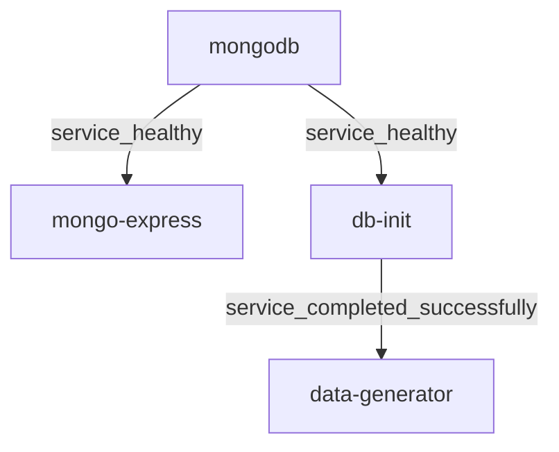
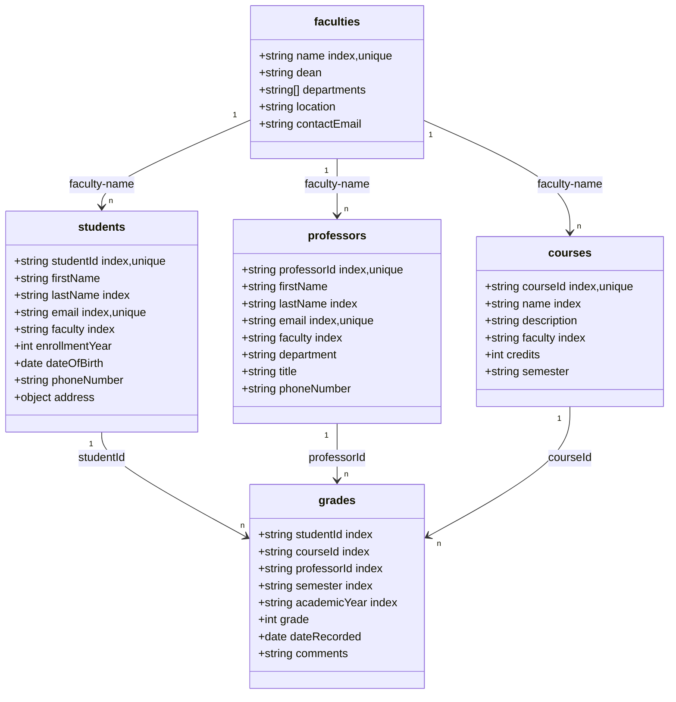

# Финальное задание по курсу "Нереляционные базы данных"

## Структура базы данных

База данных состоит из следующих коллекций:
- **students**: Информация о студентах университета
- **professors**: Информация о преподавателях университета
- **courses**: Информация о курсах университета
- **grades**: Записи об оценках студентов
- **faculties**: Информация о факультетах университета

## Автоматизация

Система состоит из 4 контейнеров:
1. MongoDB - база данных для хранения информации
2. mongo-express - веб-интерфейс для управления MongoDB
3. db-init - контейнер для инициализации структуры базы данных 
4. data-generator - контейнер для генерации тестовых данных

Все контейнеры автоматически настраиваются и проверяют свою готовность с использованием Healthcheck. Система обеспечена скриптами для автоматической инициализации структуры базы данных и генерации тестовых данных.

### Dependency Graph сборки



## Схема базы данных



## Индексы

Для оптимизации запросов в базе данных созданы следующие индексы:

### Коллекция студентов (students)
- `studentId`: Уникальный индекс для быстрого поиска студента по ID
- `email`: Уникальный индекс для обеспечения уникальности email
- `faculty`: Индекс для группировки и поиска студентов по факультету
- `lastName, firstName`: Составной индекс для сортировки и поиска по имени и фамилии

### Коллекция преподавателей (professors)
- `professorId`: Уникальный индекс для быстрого поиска преподавателя
- `email`: Уникальный индекс для обеспечения уникальности email
- `faculty`: Индекс для группировки и поиска преподавателей по факультету
- `lastName, firstName`: Составной индекс для сортировки и поиска по имени и фамилии

### Коллекция курсов (courses)
- `courseId`: Уникальный индекс для быстрого поиска курса
- `faculty`: Индекс для группировки и поиска курсов по факультету
- `name`: Индекс для поиска по названию курса

### Коллекция оценок (grades)
- `studentId, courseId, semester, academicYear`: Составной уникальный индекс для предотвращения дублирования оценок
- `courseId`: Индекс для поиска оценок по курсу
- `professorId`: Индекс для поиска оценок по преподавателю
- `academicYear, semester`: Составной индекс для поиска по учебному году и семестру

### Коллекция факультетов (faculties)
- `name`: Уникальный индекс для быстрого поиска факультета по названию

## Типовые запросы к базе данных

В данном разделе представлены типовые запросы к базе данных, которые обеспечивают наиболее востребованные операции поиска и анализа успеваемости.

### Найти всех студентов определенного факультета, отсортированных по фамилии
```javascript
db.students.find({ faculty: "Информатика" })
  .sort({ lastName: 1, firstName: 1 })
  .project({ 
    _id: 0, 
    studentId: 1, 
    firstName: 1,
    lastName: 1, 
    email: 1, 
    enrollmentYear: 1 
  });
```

### Рассчитать среднюю оценку по определенному курсу
```javascript
db.grades.aggregate([
  { $match: { courseId: "ИНФ101" } },
  { $group: { 
      _id: "$courseId", 
      averageGrade: { $avg: "$grade" },
      minGrade: { $min: "$grade" },
      maxGrade: { $max: "$grade" },
      totalGrades: { $sum: 1 }
    }
  },
  { $lookup: {
      from: "courses",
      localField: "_id",
      foreignField: "courseId",
      as: "courseInfo"
    }
  },
  { $unwind: "$courseInfo" },
  { $project: {
      _id: 0,
      courseName: "$courseInfo.name",
      averageGrade: { $round: ["$averageGrade", 2] },
      minGrade: 1,
      maxGrade: 1,
      totalGrades: 1
    }
  }
]);
```

### Получить все курсы, которые ведет определенный преподаватель
```javascript
db.grades.aggregate([
  { $match: { professorId: "AB123" } },
  { $group: { _id: "$courseId" } },
  { $lookup: {
      from: "courses",
      localField: "_id",
      foreignField: "courseId",
      as: "courseInfo"
    }
  },
  { $unwind: "$courseInfo" },
  { $project: {
      _id: 0,
      courseId: "$_id",
      courseName: "$courseInfo.name",
      faculty: "$courseInfo.faculty",
      credits: "$courseInfo.credits",
      semester: "$courseInfo.semester"
    }
  },
  { $sort: { courseName: 1 } }
]);
```

### Найти топ-5 студентов с наилучшей средней оценкой
```javascript
db.grades.aggregate([
  { $group: {
      _id: "$studentId",
      averageGrade: { $avg: "$grade" },
      totalCourses: { $sum: 1 }
    }
  },
  { $match: { totalCourses: { $gt: 2 } } },
  { $lookup: {
      from: "students",
      localField: "_id",
      foreignField: "studentId",
      as: "studentInfo"
    }
  },
  { $unwind: "$studentInfo" },
  { $project: {
      _id: 0,
      studentId: "$_id",
      firstName: "$studentInfo.firstName",
      lastName: "$studentInfo.lastName",
      faculty: "$studentInfo.faculty",
      averageGrade: { $round: ["$averageGrade", 2] },
      totalCourses: 1
    }
  },
  { $sort: { averageGrade: -1 } },
  { $limit: 5 }
]);
```

### Посчитать количество студентов по факультетам
```javascript
db.students.aggregate([
  { $group: {
      _id: "$faculty",
      totalStudents: { $sum: 1 }
    }
  },
  { $sort: { totalStudents: -1 } },
  { $project: {
      _id: 0,
      faculty: "$_id",
      totalStudents: 1
    }
  }
]);
```

### Найти курсы с наибольшим процентом неудовлетворительных оценок (ниже 4)
```javascript
db.grades.aggregate([
  { $group: {
      _id: "$courseId",
      totalGrades: { $sum: 1 },
      failingGrades: { 
        $sum: { 
          $cond: [{ $lt: ["$grade", 4] }, 1, 0] 
        } 
      }
    }
  },
  { $match: { totalGrades: { $gt: 5 } } },
  { $project: {
      _id: 0,
      courseId: "$_id",
      totalGrades: 1,
      failingGrades: 1,
      failingPercentage: { 
        $multiply: [
          { $divide: ["$failingGrades", "$totalGrades"] }, 
          100
        ] 
      }
    }
  },
  { $lookup: {
      from: "courses",
      localField: "courseId",
      foreignField: "courseId",
      as: "courseInfo"
    }
  },
  { $unwind: "$courseInfo" },
  { $project: {
      courseId: 1,
      courseName: "$courseInfo.name",
      faculty: "$courseInfo.faculty",
      totalGrades: 1,
      failingGrades: 1,
      failingPercentage: { $round: ["$failingPercentage", 1] }
    }
  },
  { $sort: { failingPercentage: -1 } },
  { $limit: 10 }
]);
```

### Получить все оценки конкретного студента с информацией о курсе
```javascript
db.grades.aggregate([
  { $match: { studentId: "A123456" } },
  { $lookup: {
      from: "courses",
      localField: "courseId",
      foreignField: "courseId",
      as: "courseInfo"
    }
  },
  { $lookup: {
      from: "professors",
      localField: "professorId",
      foreignField: "professorId",
      as: "professorInfo"
    }
  },
  { $unwind: "$courseInfo" },
  { $unwind: "$professorInfo" },
  { $project: {
      _id: 0,
      courseName: "$courseInfo.name",
      semester: 1,
      academicYear: 1,
      grade: 1,
      professorName: { 
        $concat: ["$professorInfo.firstName", " ", "$professorInfo.lastName"] 
      },
      dateRecorded: 1,
      comments: 1
    }
  },
  { $sort: { academicYear: -1, semester: 1, courseName: 1 } }
]);
```

### Сравнить средние оценки между факультетами
```javascript
db.grades.aggregate([
  { $lookup: {
      from: "students",
      localField: "studentId",
      foreignField: "studentId",
      as: "studentInfo"
    }
  },
  { $unwind: "$studentInfo" },
  { $group: {
      _id: "$studentInfo.faculty",
      averageGrade: { $avg: "$grade" },
      totalGrades: { $sum: 1 },
      students: { $addToSet: "$studentId" }
    }
  },
  { $project: {
      _id: 0,
      faculty: "$_id",
      averageGrade: { $round: ["$averageGrade", 2] },
      totalGrades: 1,
      uniqueStudents: { $size: "$students" }
    }
  },
  { $sort: { averageGrade: -1 } }
]);
```

### Определить преподавателей, которые ставят самые высокие и самые низкие оценки
```javascript
db.grades.aggregate([
  { $group: {
      _id: "$professorId",
      averageGrade: { $avg: "$grade" },
      totalGrades: { $sum: 1 }
    }
  },
  { $match: { totalGrades: { $gt: 10 } } },
  { $lookup: {
      from: "professors",
      localField: "_id",
      foreignField: "professorId",
      as: "professorInfo"
    }
  },
  { $unwind: "$professorInfo" },
  { $project: {
      _id: 0,
      professorId: "$_id",
      professorName: { 
        $concat: ["$professorInfo.firstName", " ", "$professorInfo.lastName"] 
      },
      faculty: "$professorInfo.faculty",
      title: "$professorInfo.title",
      averageGrade: { $round: ["$averageGrade", 2] },
      totalGrades: 1
    }
  },
  { $sort: { averageGrade: 1 } }
]);
```

### Проанализировать распределение оценок по семестрам
```javascript
db.grades.aggregate([
  { $group: {
      _id: { 
        academicYear: "$academicYear", 
        semester: "$semester" 
      },
      averageGrade: { $avg: "$grade" },
      gradesCount: { $sum: 1 },
      gradeDistribution: {
        $push: "$grade"
      }
    }
  },
  { $project: {
      _id: 0,
      academicYear: "$_id.academicYear",
      semester: "$_id.semester",
      averageGrade: { $round: ["$averageGrade", 2] },
      gradesCount: 1,
      excellentGrades: {
        $size: {
          $filter: {
            input: "$gradeDistribution",
            as: "grade",
            cond: { $gte: ["$$grade", 9] }
          }
        }
      },
      goodGrades: {
        $size: {
          $filter: {
            input: "$gradeDistribution",
            as: "grade",
            cond: { $and: [
              { $gte: ["$$grade", 7] },
              { $lt: ["$$grade", 9] }
            ]}
          }
        }
      },
      averageGrades: {
        $size: {
          $filter: {
            input: "$gradeDistribution",
            as: "grade",
            cond: { $and: [
              { $gte: ["$$grade", 4] },
              { $lt: ["$$grade", 7] }
            ]}
          }
        }
      },
      lowGrades: {
        $size: {
          $filter: {
            input: "$gradeDistribution",
            as: "grade",
            cond: { $lt: ["$$grade", 4] }
          }
        }
      }
    }
  },
  { $sort: { academicYear: -1, semester: 1 } }
]);
```

## Доступы к данным

### Mongo Express
- **URL**: `http://localhost:8081`
- **Логин**: `admin`
- **Пароль**: `password`

## Сборка, деплой и запуск проекта

1. Склонировать проект:
    ```
    git clone git@github.com:avshapoval/non_rel_finals.git
    ```
2. Перейти в корневую директорию проекта:
    ```
    cd non_rel_finals
    ```
3. Запустить команду:
    ```
    docker compose up --build [-d]
    ```
4. После сборки проекта и его развертывания будет доступен интерфейс mongo-express на порту 8081.